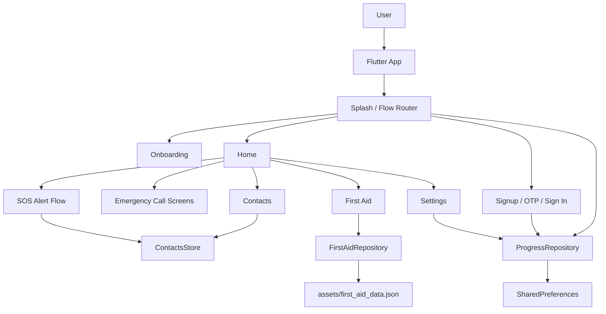
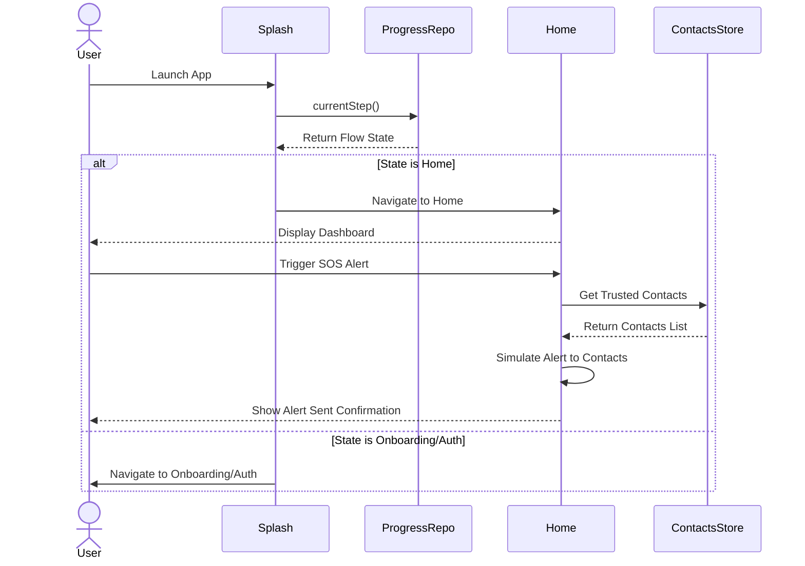

# Nkwa

Nkwa is a Flutter mobile safety app for emergency response, trusted contacts, SOS alerts, and offline first-aid guidance. The app is built as a polished local prototype: user progress, emergency contacts, and first-aid content are handled on-device so the core safety experience can work without relying on a live backend.

## Architecture Diagram



## Sequence Diagram



### Main Layers

- `lib/main.dart`: App entry point, `MaterialApp`, and screen scaling setup.
- `lib/screens`: Feature screens for onboarding, authentication, home, SOS, emergency calls, contacts, first aid, and settings.
- `lib/core`: Shared app models, colors, stores, and repositories.
- `assets/first_aid_data.json`: Offline first-aid guide content loaded at runtime.

## Setup Instructions

### Prerequisites

- Flutter SDK installed and available on your PATH.
- Dart SDK compatible with `sdk: ^3.9.2`.
- Android Studio, VS Code, or another Flutter-ready IDE.
- An Android emulator, iOS simulator, or connected physical device.

### Run Locally

```bash
cd nkwa
flutter pub get
flutter run
```

### Analyze and Test

```bash
cd nkwa
flutter analyze
flutter test
```

### Project Assets

The app registers the full `assets/` directory in `pubspec.yaml`. First-aid guide data lives at:

```text
assets/first_aid_data.json
```

If you add new offline guides, update that JSON file and keep each guide compatible with the `FirstAidEntry` model in `lib/core/first_aid_entry.dart`.

## API Documentation

This prototype does not currently call an external HTTP API. Instead, it relies on local repositories (`ProgressRepository`, `ContactsStore`, `FirstAidRepository`) to manage state and load offline assets like the first-aid guides.

## The Developer's Choice

The added feature is a stronger offline safety layer: the first-aid library now includes full step-by-step detail pages for every guide instead of leaving most topics as "coming soon". This matters because emergencies are exactly when users may have weak signal, low battery, or no time to search the web. Keeping the guides in a local JSON asset makes the feature fast, searchable, and available offline.

I also made contact search functional. The contacts screen now filters by name, relationship, phone number, and email, with a clear empty state. This supports the main safety workflow: a user can quickly check who is in their emergency circle before triggering or configuring SOS alerts.


